<h1 align="center">Hi 👋 I'm Erine Anna Binu</h1>

  <b>Computer Science Student • Builder • Problem Solver</b>

  I build technology around problems worth solving.

---

### 👩‍💻 About Me

I'm a Computer Science student passionate about turning ideas into **useful digital experiences**.

I enjoy building projects across **web development, data-driven systems, and emerging technologies**, with a particular interest in creating solutions that address real-world problems.

Currently exploring, learning, and building. 🚀

* 💻 Building projects that solve real problems
* 🌱 Exploring **Full-Stack Development, AI/ML & Human-Computer Interaction**
* 💡 Interested in **technology, innovation & product building**
* 🤝 Open to collaborating on meaningful projects
* ⚡ Turning ideas into reality, one project at a time

---

## 🧠 Skills & Tech Stack

### 💻 Languages

  

### ⚙️ Development

  

### 🗄️ Databases

  

### 📊 Data & Machine Learning

  

`Pandas` • `NumPy` • `Matplotlib` • `Scikit-learn`

### 🛠️ Tools

  

---

## 🚀 What I'm Building

🧠 **Attention Arc** — Exploring technology-driven approaches to attention and productivity.

🏥 **Medinova Connect** — A healthcare-focused platform designed around better access and connectivity.

✈️ **Naviero** — A flight ticket management system.

📊 **Alumni Tracking Dashboard** — A data-driven dashboard for managing and visualizing alumni information.

---

## 🌐 Let's Connect

  
  &nbsp;
  

[💼 LinkedIn](https://www.linkedin.com/in/erine-anna-binu-9a436531b/) • [💻 GitHub](https://github.com/Er-ine)

---
## 📈 GitHub Stats

  
  

